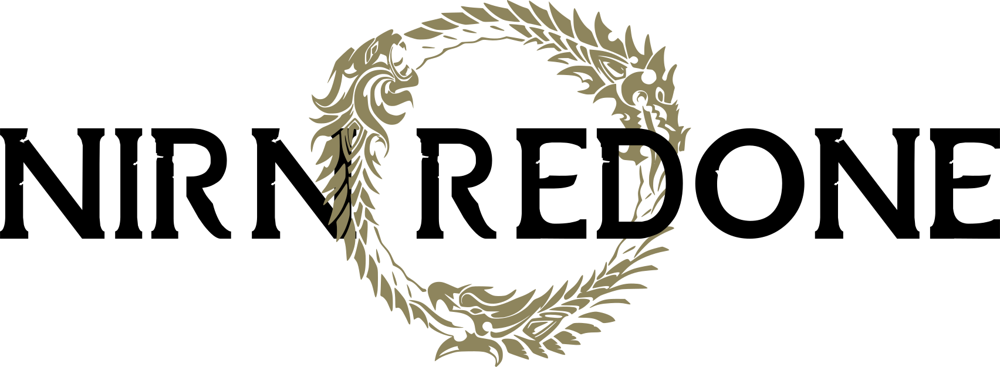

     
    
    <h1>Nirn Redone</h1>
    <h3>A Cartography Project</h3>

The Nirn Redone project is a cartography endeavour to recreate Skyrim, Tamriel, and possibly Nirn, depending on the number of volunteers and their motivation. The goal is to massively expand the size of the land to be more realistic. This is purely a passion project with no intention to create anything else from these maps. If you find use for them though, I'd be more than happy to hear about it.

Maps are created as SVG files to be viewed and printed at any scale. Some idiosyncrasies arise from working with vector files: these will hopefully be alleviated / worked on over time for quality-of-life improvements when drawing.

**Disclaimer**: I am not very familiar with the TES lore, nor do I care to be. As long as the maps are *somewhat* accurate lore-wise, I don't personally see an issue. Feel free to set the era for your own reworked versions and modify the maps for better accuracy as you see fit.

### Contribution

If you wish to contribute to this project, you can fork it, work on your own map, and send a pull request here to integrate it. SVG files can be worked on in Adobe Illustrator or Inkscape, the latter being a free and open source option. If you want it added to the main repository, I'd appreciate if you could follow the design guidelines [here](./STYLE.MD).

Large SVG files (over 50 MB) must be stored with Git LFS. Optimized versions can be created by running them through [SVGO](https://jakearchibald.github.io/svgomg/). You should never work on the optimized version: it's intended to be a final product.

#### Requirements

- Inkscape or Adobe Illustrator;
- Git + Git LFS.

### Progress:

  

    <a href="./SKYRIM/skyrim_redone.svg">Skyrim</a>:
  

  

    <ul>
      <li>
        Missing topography;
      </li>
      <li>
        Missing roads;
      </li>
      <li>
        Missing thane, hilmr, and kirk allegiances.
      </li>
    </ul>
  

### Special Thanks

- Koveich: creator of the [Sovngarde font](https://www.nexusmods.com/skyrimspecialedition/mods/386);
- [Project Tamriel](https://project-tamriel.com): color scheme taken from their maps;
- DeFlame: creator of the [original Skyrim map](https://www.reddit.com/r/imaginarymaps/comments/dut8n4/skyrim_3e_365/).
